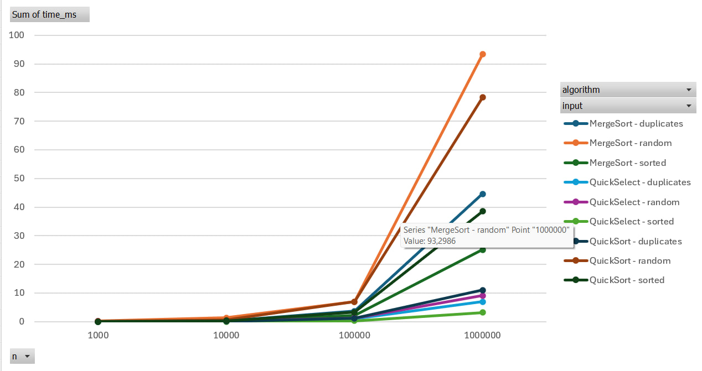
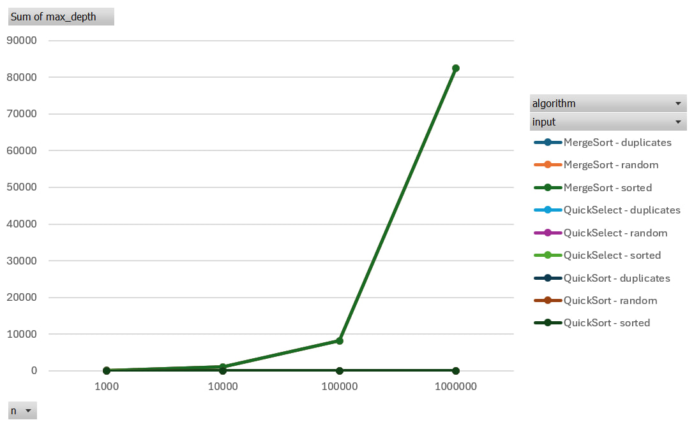
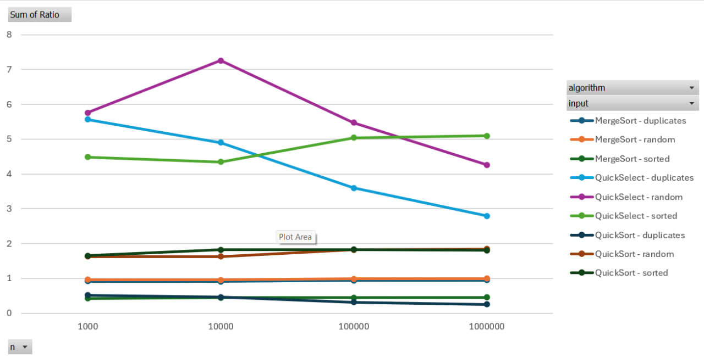

# Analysis of Sorting and Selection Algorithms

## 1. Asymptotic Bounds
| Algorithm | Best Case | Average Case | Worst Case | Reason |
| :--- | :--- | :--- | :--- | :--- |
| **MergeSort** | $\Theta(n \log n)$ | $\Theta(n \log n)$ | $\Theta(n \log n)$ | The array is always divided strictly in half, regardless of the input data. |
| **QuickSort** | $\Theta(n \log n)$ | $\Theta(n \log n)$ | $O(n^2)$ | The worst case occurs with a poor pivot choice, but a random pivot makes the average case $\Theta(n \log n)$. |
| **QuickSelect** | $\Theta(n)$ | $\Theta(n)$ | $O(n^2)$ | On average, half of the array is discarded at each step, but with poor partitions, the recursion depth can reach $n$. |
| **Insertion Sort** | $\Theta(n)$ | $\Theta(n^2)$ | $\Theta(n^2)$ | The best case is an already sorted array (the inner loop terminates immediately). The worst case is a reverse-sorted array. |

## 2. Recurrences (Master Theorem)
General form of the Master Theorem: $T(n) = aT(n/b) + f(n)$

*   **MergeSort:**
    Equation: $T(n) = 2T(n/2) + \Theta(n)$
    Parameters: $a = 2$, $b = 2$, $f(n) = \Theta(n)$.
    Since $\log_b a = \log_2 2 = 1$, and $f(n) = \Theta(n^1)$, this is Case 2 of the Master Theorem.
    **Result:** $T(n) = \Theta(n \log n)$.

*   **QuickSort (assuming a balanced split):**
    Equation: $T(n) = 2T(n/2) + \Theta(n)$
    Although the split is rarely exactly 50/50 in reality, a random pivot prevents systematic poor splits (e.g., 0 and $n-1$). On average, the split is proportional (e.g., $1/4$ and $3/4$), which mathematically guarantees a recursion tree depth of $\approx \log n$ and an overall time complexity of $\Theta(n \log n)$.

*   **QuickSelect (assuming a balanced split):**
    Equation: $T(n) = 1T(n/2) + \Theta(n)$ (since we only process the required half).
    Parameters: $a = 1$, $b = 2$, $f(n) = \Theta(n)$.
    Since $\log_b a = \log_2 1 = 0$, and $f(n) = \Theta(n^1)$, $f(n)$ polynomially dominates $n^0$ (Case 3 of the Master Theorem).
    **Result:** $T(n) = \Theta(n)$.

## 3. Plots

**Time vs n:**

**Max recursion depth vs n:**

**Ratio vs n:**

## 4. $\Theta$ Check
Analyzing the Ratio plots, we can see that as the array size $n$ increases to 1,000,000, the ratio `comparisons / (n * log2(n))` for the sorting algorithms stabilizes and becomes an almost horizontal line. This empirically proves that the number of comparisons $f(n)$ grows at the same rate as $g(n) = n \log n$.
Based on the plot, we can estimate the constants for the definition of $\Theta$: $c_1 \cdot g(n) \le f(n) \le c_2 \cdot g(n)$ for all $n \ge n_0$. The curve becomes bounded between constants roughly around $c_1 \approx 0.5$ and $c_2 \approx 2.0$ starting from $n_0 = 1000$.

## 5. Discussion
The collected practical measurements fully match the theoretical asymptotic bounds. The horizontal lines on the Ratio plots prove the tight $\Theta$ bounds. However, the absolute execution time (Time vs $n$) is affected by architectural features and the Java runtime environment.

For small arrays (1,000 elements), JVM warm-up has a significant impact: the initial runs are slower due to JIT compilation of the bytecode. The time difference between algorithms is also explained by memory access patterns. For instance, on modern architectures like the Intel Core i7-13650HX with a large L2/L3 cache, QuickSort performs significantly faster because it swaps elements in-place, ensuring a high cache hit rate. MergeSort, conversely, constantly allocates memory for the `temp` array, leading to cache misses and forcing the Garbage Collector to consume extra CPU cycles. Finally, the cutoff optimization (switching to Insertion Sort for subarrays $\le$ 15) eliminated recursion overhead at the bottom of the call tree, noticeably speeding up both sorting algorithms at the micro-level.